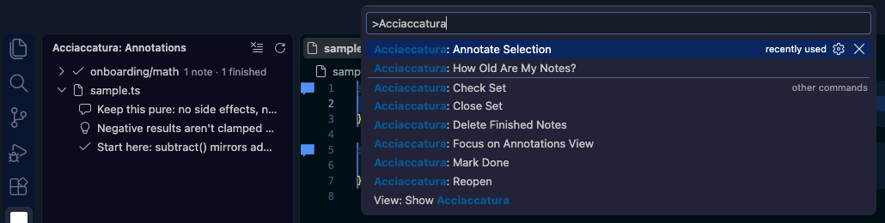
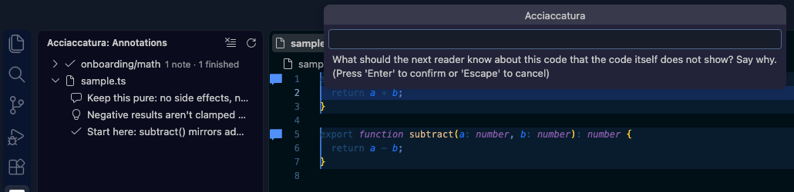
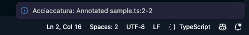
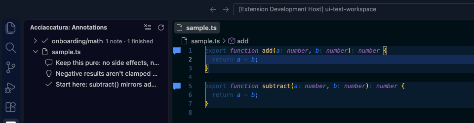

# Acciaccatura

**Review your agent's work.** Leave durable, AI-readable notes on code — intent, constraints,
gotchas, decisions — right in the editor. Any MCP-capable agent (Claude Code, Copilot, Cursor,
and others) reads the same notes through the [Acciaccatura MCP server](https://github.com/edCariadhy/acciaccatura/tree/master/packages/mcp-server),
so context you leave for an agent isn't locked to one IDE.

> An *acciaccatura* is a grace note: a tiny note sounded just before the main one that colours
> how it's heard. A small annotation that shapes how an agent reads the code that follows.

## What it does

- **Annotate a selection, a single line, or just the caret.** Select code — or place the caret
  with nothing selected — and run **Acciaccatura: Annotate Selection** from the Command Palette
  or a right-click in the editor. It's saved locally to `.acciaccatura/annotations.json` in the
  workspace.
- **See notes in the gutter.** Annotated lines get a gutter icon; hover it for the note body and
  the author's trust level.
- **Manage notes from the sidebar.** The Acciaccatura activity-bar view lists every annotation,
  grouped by file. Right-click to delete a note, or promote an agent-suggested note to
  authoritative once you've reviewed it.
- **Close the loop.** Mark a note done once its work is finished, reopen it if that was wrong,
  and clear out finished notes when they're safe to delete. **How Old Are My Notes?** shows how
  long open notes have waited and finished notes have been sitting around.
- **Group notes into a named set.** A *scope* is a named, ordered set of notes — a PR review or
  an onboarding tour, not just notes scattered across files. Check a set's status, add to it, or
  close it from the sidebar.
- **Degrades loudly, never silently.** If code moves, the extension re-anchors the note
  automatically. If it can't — the code was deleted or changed beyond recognition — you get a
  clear warning instead of a note quietly pointing at the wrong lines.

## How it fits with agents

Notes you write here, and notes an agent writes over MCP, live in the same store. Provenance
(`human` vs `agent`) and trust level travel with every note, so an agent knows to treat a
suggested note differently from an authoritative one — and you can review and promote agent
notes from the sidebar before they're trusted.

Notes are advisory, never authority: an agent is expected to produce correct work even when a
note is stale, wrong, or missing.

## How to Use

### 1. Write a note

Select the code you want to annotate — or just place the caret on a line, no selection needed —
and run **Acciaccatura: Annotate Selection**. Reach it from the Command Palette, or right-click
in the editor:

Say what the next reader — a person or an agent — needs to know that the code itself does not
show, and press Enter:

A message confirms where it landed:

### 2. See it without leaving the file

Annotated lines get a gutter icon. Hover it for the note body and who wrote it — a person or an
agent, and how far to trust it. If the code under a note changes, the extension re-anchors it
automatically; if it can't, the icon turns into a loud warning instead of staying silent about a
note that no longer matches.

### 3. Manage notes from the sidebar

Open the **Acciaccatura** view in the activity bar. Notes are grouped by file, and named sets
(*scopes*) appear above the files, read in the order their author gave them:

From here:

- **Right-click a note** to delete it, or promote an agent's suggestion to authoritative once
  you've reviewed it.
- **Right-click a set** to check its status against the code, add another note to it, or close
  it once its work — a review, a tour — is done.
- Run **How Old Are My Notes?** (Command Palette) to see how long open notes have waited, and
  how long finished ones have been safe to delete.

### 4. Let an agent read and write the same notes

Point any MCP-capable agent at the
[Acciaccatura MCP server](https://github.com/edCariadhy/acciaccatura/tree/master/packages/mcp-server)
— see the [project README](https://github.com/edCariadhy/acciaccatura#use-the-mcp-server) for
setup. It reads and writes the same store this extension does, so a note you leave here is what
the agent sees, and a note an agent leaves is what shows up for you to review.

## Privacy

Notes are stored locally in the workspace (`.acciaccatura/annotations.json`), committed by
default so a PR's notes reach the reviewer the same way the code does. Nothing is sent over the
network — sharing a note means sharing that file, and that's your call, not the extension's.

## Status

Early and under active development. See the
[project repository](https://github.com/edCariadhy/acciaccatura) for source, issues, and the
MCP server.

## License

MIT
